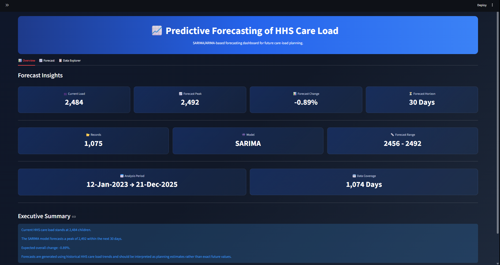
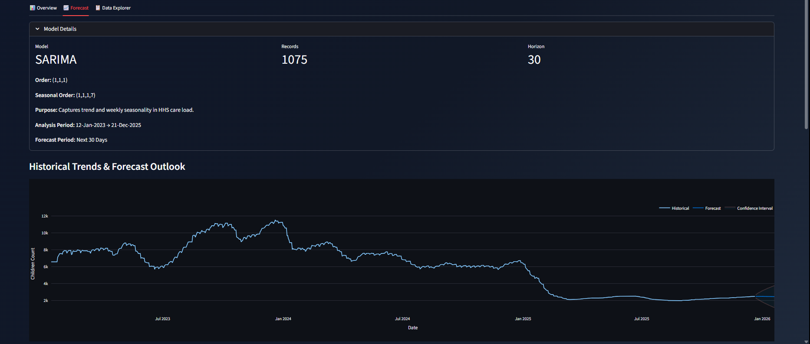
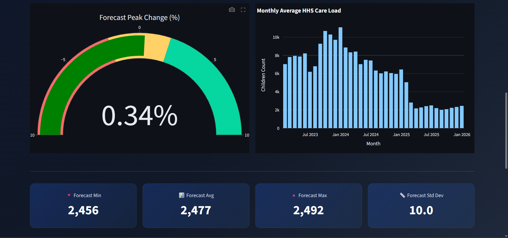
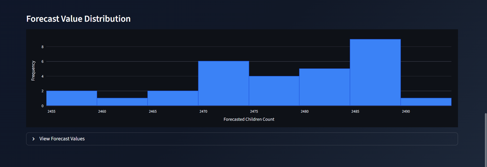
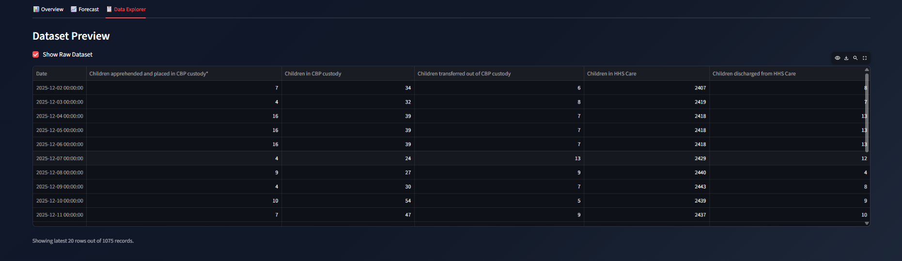
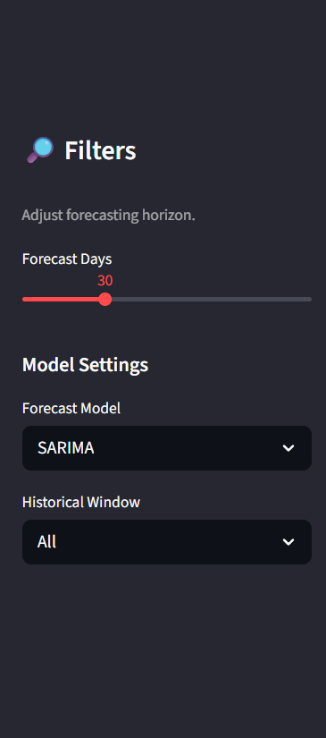

# 📈 Predictive Forecasting of HHS Care Load

An interactive forecasting dashboard built using **Python, Streamlit, Plotly, ARIMA, and SARIMA** to predict future HHS (Health and Human Services) care load trends and support planning decisions through data-driven forecasting.

---

## 🚀 Project Overview

This project analyzes historical HHS care load data and generates future forecasts using time-series forecasting techniques.

The dashboard provides:

- Historical trend analysis
- ARIMA and SARIMA forecasting
- Forecast confidence intervals
- Interactive filtering and controls
- Forecast performance insights
- Monthly care load analysis
- Forecast distribution analysis
- Dataset exploration

---

## 🎯 Problem Statement

Organizations responsible for managing HHS care programs require accurate forecasts of future care load demand to support:

- Resource allocation
- Capacity planning
- Operational decision-making
- Demand forecasting
- Strategic planning

This project helps estimate future care load trends using historical data patterns.

---

## 🛠️ Technologies Used

### Programming
- Python

### Data Processing
- Pandas
- NumPy

### Forecasting Models
- ARIMA
- SARIMA

### Visualization
- Plotly

### Dashboard Development
- Streamlit

---

## 📊 Dashboard Features

### 📋 Overview Tab

Provides key forecasting insights:

- Current Load
- Forecast Peak
- Forecast Change %
- Forecast Horizon
- Records Count
- Forecast Range
- Analysis Period
- Data Coverage
- Executive Summary

---

### 📈 Forecast Tab

Provides forecasting analysis and model insights:

#### Model Details
- Selected Model
- Training Records
- Forecast Horizon
- Model Configuration
- Analysis Period

#### Forecast Visualizations
- Historical Trends & Forecast Outlook
- Confidence Interval Analysis
- Forecast Peak Change Gauge
- Monthly Average HHS Care Load
- Forecast Statistics
- Forecast Value Distribution

#### Export Options
- Download Forecast CSV

---

### 📄 Data Explorer Tab

Allows users to:

- Preview raw dataset
- Inspect records
- Validate forecasting inputs

---

## 🤖 Forecasting Models

### ARIMA
Captures historical trend patterns without seasonal effects.

### SARIMA
Captures both trend and seasonal patterns within the HHS care load data.

---

## 📁 Project Structure

```text
HHS-Care-Load-Forecasting/
│
├── streamlit_app.py
├── processed_hhs_data.csv
├── requirements.txt
├── README.md
└── screenshots/
```

---

## 📷 Dashboard Preview

Add screenshots of your dashboard here after uploading them.

### Overview Dashboard



### Forecast Dashboard





### Data Explorer
-


### Filters



---

## ⚙️ Installation

Clone the repository:

```bash
git clone https://github.com/yourusername/HHS-Care-Load-Forecasting.git
```

Navigate into the project directory:

```bash
cd HHS-Care-Load-Forecasting
```

Install dependencies:

```bash
pip install -r requirements.txt
```

Run the Streamlit application:

```bash
streamlit run streamlit_app.py
```

---

## 📌 Key Insights

- Historical care load trends can be analyzed interactively.
- Forecast demand can be projected for customizable forecast horizons.
- Confidence intervals help quantify forecast uncertainty.
- SARIMA effectively captures weekly seasonal behavior in the dataset.
- Dashboard visualizations support operational planning decisions.

---

## 🌐 Live Demo

Streamlit Deployment:

```text
https://hhs-care-load-forecasting-shank204.streamlit.app/
```

---

## 📚 Learning Outcomes

Through this project, I gained hands-on experience with:

- Time Series Forecasting
- ARIMA & SARIMA Modeling
- Data Visualization with Plotly
- Streamlit Dashboard Development
- Forecast Evaluation & Interpretation
- Building End-to-End Data Science Projects

---

## 👨‍💻 Author

**Shantanu Kamble**

Aspiring Data Analyst | Data Science Enthusiast

Skills:
- Python
- SQL
- Excel
- Power BI
- Tableau
- Machine Learning
- Data Visualization

---

## ⭐ Acknowledgements

This project was developed as part of a Data Science internship and focuses on applying forecasting techniques to real-world planning and decision-making scenarios.
